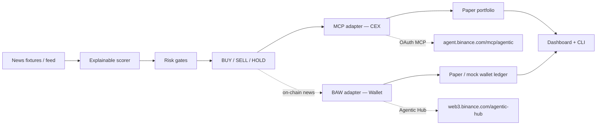

# NewsPulse

Track A product for the **Binance Agent OS Mini Hackathon 2026**.

News-driven multi-asset trading workflow agent: **news to explainable scores to risk-checked BUY/SELL/HOLD** across the **top 10 market-cap coins excluding stablecoins**.

## Dual-rail Agent OS

Binance Agent OS has **both** rails — NewsPulse wires both:

| Rail | Role | Endpoint |
|------|------|----------|
| **MCP** | CEX: market data, agentic sub-account, spot/futures under confirmations | `https://agent.binance.com/mcp/agentic` (`oauth_client_id=grok`) |
| **BAW** | Wallet / on-chain: Agentic Hub swaps & DeFi-style flows with daily caps | `https://web3.binance.com/agentic-hub` |

Paper/mock when live is unavailable; every mock path is labeled.

## Features

- Universe: BTC, ETH, BNB, SOL, XRP, DOGE, ADA, TRX, AVAX, LINK (hardcoded top-10 non-stables in `src/core/universe.ts`; optional best-effort CoinGecko refresh when online — falls back to hardcoded)
- Explainable scoring with keyword lexicon + symbol mapping + fixture sentiment hints
- Risk: max position per asset, max daily trades, cooldown, portfolio concentration, kill-switch
- **MCP adapter** — OAuth (`oauth_client_id=grok`), no API keys on device
- **BAW adapter** — paper/mock wallet ops (balance, quote/execute swap within documented daily caps, kill-switch)
- Dual-rail facade + dashboard statuses for both adapters
- Vite + React dashboard + CLI demo
- `npm run demo` asserts BUY+SELL on MCP paper path **and** at least one BAW wallet action

## Architecture



## Quick start

> **Paper/sim only — no live txs.** Keep `NEWSPULSE_MODE=paper` for demos and judging.

```bash
git clone https://github.com/herewegoagain4436-creator/newspulse-binance-agent-os.git
cd newspulse-binance-agent-os
npm install
npm run demo
npm run dev
```

Copy `.env.example` to `.env` if you want to tweak thresholds. Keep `NEWSPULSE_MODE=paper` for demos.

## Agent OS usage

See **AGENT_OS_NOTES.md** for MCP + BAW endpoints, OAuth, documented wallet caps, scopes, and doc URLs.

Grok MCP registration (reference):

```text
add binance-mcp-server with url=https://agent.binance.com/mcp/agentic oauth_client_id=grok
```

Do **not** open the MCP endpoint in a browser.

BAW hub (wallet): https://web3.binance.com/agentic-hub

## Scripts

| Script | Purpose |
|--------|--------|
| `npm run demo` | Fixture loop with BUY+SELL (MCP) + BAW wallet action |
| `npm run dev` | Vite dashboard |
| `npm run cli` / `npm run agent:once` | JSON once-run |
| `npm run build` | Typecheck + Vite build |

## Key files

- `src/core/` — universe, scorer, risk, portfolio, agent loop
- `src/adapters/binanceAgentOs.ts` — MCP CEX adapter (paper/mock/live)
- `src/adapters/bawAgenticWallet.ts` — BAW wallet / Agentic Hub adapter
- `src/adapters/agentOsFacade.ts` — dual-rail facade (MCP + BAW)
- `src/cli/demo.ts` — demo runner
- `src/ui/` — React dashboard (both adapter statuses)
- `src/data/fixtures/` — news + market snapshots
- `AGENT_OS_NOTES.md`, `DEMO.md`, `BRIEF.md`

## Disclaimer

Not financial advice. Paper and mock fills are **not** live Binance orders. Live Agent OS trades require user confirmation; the agentic sub-account starts empty and has no withdrawal scope. BAW daily caps cited in-code are **documented defaults** from public materials (e.g. ~$50k swaps / ~$100k DeFi / $20 x402) — **not invented guarantees**; confirm live quotas in the Binance App / wallet settings.
